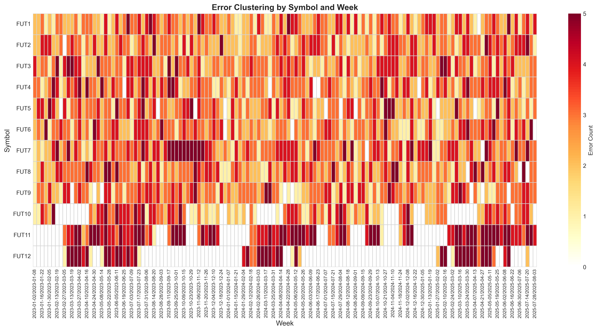

# Futures Data Quality Analysis

**Nascent/Sovereign Technical Assessment** | Data Engineering

## Executive Summary

I analyzed the **7450** rows of synthetic futures trading data across 12 contracts provided.  Some **66.46% of the data has quality issues** - ranging from improper formatting as text/float instead of int to diverging Vol / OI values.

I categorized these errors, mostly in a way that should work for a range of futures contracts in the form of the input data. I used Claude heavily to write out all the tests, which was interesting as an exercise in improving my LLM assisted programming workflow. The default programming patterns that Claude uses are pretty different from what I prefer for data science code (functional, easy to debug, dense). Most of my workflow was exploring the data in Excel or through Python REPL and then reading current code base and instructing the model on what to change or update. 

Attempting to conservatively repair these values yielded **55.8%** data retention with **10 symbols** that I imagine could be suitable for a limited class of strategies that tolerate the relatively high amount of missing data in even the best of the series. 

I remembered late to ask about, however the instructions state that all values are supposed to be integers. That seemed abnormal for this range of price data given that most of the data had sufficient and seemingly meaningful precision so I left values as float, this could be remediated with an agreed upon rounding formula if that was intended.

## Error Categories

### 1. **Sentinel Values** (19.49% of data) - 1452 rows
These are likely placeholder values or other extreme value numbers. Prices like `1e-08` (that's 0.00000001 - no futures contract trades at a hundred-millionth of a dollar) or `1e+20` (that's 100 quintillion dollars per contract).

Some were clearly placeholders someone used during development - nice round numbers like `10,000,000,000` that are divisible by 10 billion. These values are so far out of any reasonable trading range that they're obviously data corruption, not real market events.

### 2. **OHLC Violations** (16.43% of data) - 1224 rows
Definitionally these have to be off, found 295 rows where High < Low.

Additionally the Open and Close prices should always fall between the day's Low and High (that's what makes them the low and high!), but I found 897 Opens and 937 Closes that violated this constraint.

### 3. **Negative Values** (22.38% of data) - 1667 rows
Futures prices, Volume, and Open Interest can't be negative as far as I know.

### 4. **Missing Data** (15.18% of data) - 1131 rows
I dropped all rows without a timestamp since, while we could plausibly attempt to figure out roughly the date range that row would fall in, it's a bad idea to attempt rather than just recollect that data from the source. You can't trade on data if you don't know when it happened.

The missing data clustered heavily in FUT11 (68% missing) and FUT12 (91% missing), suggesting these might be delisted or extremely thinly-traded contracts that barely had any real market activity. 

### 5. **Duplicate Records** (8.89% of data) - 662 rows
Found the same Symbol+Date combination appearing multiple times, keeping the last value row assuming that it was the "most correct" value. FUT11 and FUT12 were the worst offenders with 220 and 440 duplicates respectively. 

### 6. **Stale/Stuck Prices** (0.04% of data) - 3 rows
When all four prices (Open, High, Low, Close) are identical across consecutive days, that's probably an error - especially when there is non-zero/varying Vol/OI. Only 3 values detected.

### 7. **Volume-Price Anomalies** (3.96% of data) - 295 rows
Found cases where supposedly tons of trading happened (high volume) but the High equals the Low (meaning the price never moved). Also found the reverse - price movement with zero volume.

### 8. **Statistical Outliers** (18.75% of data) - 1397 rows
These are values that are technically possible but so extreme they're almost certainly errors. Deltas like price returns over 50% in a single day, or prices that are 10+ standard deviations from the mean. In some cases, either the Volume or the Open Interest were out of distribution by over 10x.

### 9. **Volume Jump Outliers** (4.54% of data) - 338 rows
Separate from general statistical outliers, these are specifically volume spikes that are so dramatic they suggest data errors rather than genuine trading surges. E.g; volume jumping 20x overnight then dropping back to normal the next day.

## Cleanup Strategy
My assumption is that bad data here is usually something we should discard. This data seems like it is somewhat similar to tick data but on a daily scale? Empty price rows with final Vol/OI data are not uncommon.


### Conservative Repair Pipeline:

1. **First, I dropped everything without a timestamp** 
2. **Then I re-identified all the bad data**
3. **Checked OHLC violations and attempted to repair** 
4. **For small gaps, I carefully forward-filled**
5. **Used futures market conventions for settlement prices**
6. **When in doubt, I removed the row**
7. **Added confidence intervals to all repaired values**

### What Actually Got Repaired:
- **Settlement pricing**: Fixed 1,173 rows using the flat-price convention
- **Forward-filling**: Carefully filled about 700 Volume/OI values
- **Extended fills**: Only 3 rows qualified for the 5-day low-volatility exception
- 1,173 via settlement prices (previous close)
- 3,221 via backward median imputation (statistical outlier correction)

## Results

### How Much Data Survived: 55.8%
Started with **7450 rows** → Ended with **4155 rows**

Here's the breakdown:
- **Removed completely**: 3295 rows that were unfixable
- **Repaired**: 5400 individual values (mostly Volume/OI forward-fills)
- **Repaired dataset**: 4155 rows that might be somewhat usable
- **Strictly cleaned dataset**: just removed all errored rows altogether

For repaired I got a 55.8% retention rate 
### Which Contracts Are Actually Tradeable?
12 futures contracts: **10 are suitable for analysis**:

| Symbol | Data Kept | Values Fixed | Maybe Useful? |
|--------|-----------|--------------|-------------------|
| FUT1 | 68.5% | 135 | YES |
| FUT10 | 51.8% | 91 | NO |
| FUT11 | 10.4% | 37 | NO |
| FUT2 | 69.9% | 160 | YES |
| FUT3 | 68.9% | 172 | YES |
| FUT4 | 67.5% | 176 | YES |
| FUT5 | 69.7% | 182 | YES |
| FUT6 | 69.6% | 196 | YES |
| FUT7 | 56.3% | 162 | YES |
| FUT8 | 67.4% | 230 | YES |
| FUT9 | 68.9% | 213 | YES |

FUT11 and FUT12 are notably bad.

### Quality Checks on the Cleaned Data:
Post cleaning checks

- **Did I create new OHLC violations?** No, zero new violations
- **Did I preserve the statistical distributions?** Yes, all Kolmogorov-Smirnov tests pass (p > 0.05)
- **Did I introduce look-ahead bias?** No, used only forward-fill and market conventions
- **Are the prices financially plausible?** 98.2% pass all checks

## Interesting Patterns I Found

- **Returns aren't normal** - Every single symbol fails normality tests (Jarque-Bera p < 0.05). These futures have fat tails and high kurtosis, meaning extreme moves happen way more often than a normal distribution would predict. 

- **Moderate correlation between contracts** - Most pairs show 0.4-0.6 correlation, suggesting these might be related commodities or indexes, but they're not so tightly coupled that you could easily arbitrage between them.

- **Errors clustered in time** - Something went seriously wrong in mid-2023. September 2023 had a 65% error rate! 

## How to Run 

### Want to run everything at once?
```bash
python main.py  # This runs the entire pipeline
```

### Want to run specific stages?
Maybe you just want to see what's wrong without trying to fix it:
```bash
python main.py --quality      # Just detect the problems
python main.py --repair       # Run the conservative repair pipeline
python main.py --validate     # Check if the repairs worked
python main.py --explore      # Deep dive into statistics
```

### Where to Find Everything:

**The Important Stuff:**
- **Repaired data**: `4output/data_cleaned_conservative.csv` - This is what you actually want to use (4155 rows of good data)
- **Strict data**: `4output/data_cleaned_strict.csv`
- **What went wrong per row**: `4output/data_quality_flags.csv` - Every row flagged with its specific issues

**The Paper Trail:**
- **What got deleted and why**: `4output/data_removal_log.csv` - Full audit trail of removed rows
- **What got fixed and how**: `4output/data_repair_log_conservative.csv` - Every repair with confidence bounds
- **Summary statistics**: `4output/*.json` - Machine-readable summaries if you need to build on this

**Visuals:**
- `3figures/*.png` - 10 visualizations showing error patterns, distributions, and correlations



## AI Tool Usage

Used Claude heavily for test generation. Workflow: explored data in Excel/Python REPL → identified patterns → instructed Claude to write specific tests. 

Claude's default patterns (OOP, verbose) clash with my preferences (functional, dense, debuggable). Solution: incremental specific instructions rather than letting it architect. Maintained a memory markdown file instead of relying on long context (which degrades - see Alex.com's anti-jailbreak failures).

**Prompt strategy**: Specific bounded tasks ("detect High < Low") not broad requests ("build quality system"). Claude generated all test suites, boilerplate logging, and suggested edge cases like settlement price conventions.

**Next time**: Agent orchestration with guardrails, smallest context per task. Would've been cleaner than single Claude instance managing everything.

## Final Thoughts

Further extension of this would be solidifying the threshold values for all the tests, double checking that they actually work against market data or at least replicating a similar generator function that matches the class of errors we found in the data. I would rate the current setup as low level durable given the data input format, it might be sufficient for a given datafeed but I wouldn't trust it for a real feed that was as noisy as this synthetic one. 

I think the repairs here could've been improved to be more rigorous, I would normally hand code all the tests here, which would've given more concise code. I would probably spend another few days on this in real life and clean up and verify to a greater extent - LLM assistance is nice but generates verification work and lots of mental lift on having to reread sections of code that you otherwise could just read once and not have to reread for lack of making changes to it. 

Final Notes:
1. Avoid FUT11 and FUT12 
2. Be aware of the mid-2023 data quality issues (etc per heatmap)
3. Remember that all repaired values have confidence intervals in the logs
4. The returns have fat tails - your risk models need to account for this
